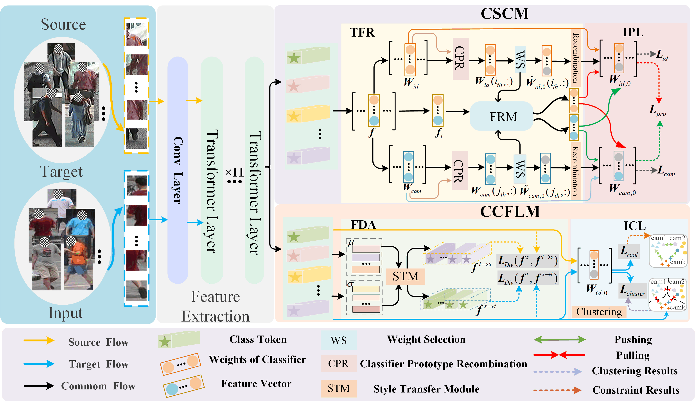

# Domain-adaptive Person Re-identification without Cross-camera Paired Samples [[arxiv]](https://arxiv.org/abs/2307.06533)


## Framework of our method



## Usage

- This project is based on TransReID[1] ([paper](https://openaccess.thecvf.com/content/ICCV2021/papers/He_TransReID_Transformer-Based_Object_Re-Identification_ICCV_2021_paper.pdf) and [official code](https://github.com/heshuting555/TransReID))
- Usage of this code is free for research purposes only. 

## Requirements
- python = 3.9
- torch = 1.7.1
- torchvision = 0.8.2
- opencv-python = 4.5.1.48
- timm = 0.4.5
- yacs = 0.1.8

###  
```bash
We use a single NVIDIA RTX3090 GPU for training and evaluation.
```


### Prepare Datasets

```bash
mkdir data
```

Download the person datasets **Market1501**, **MSMT17**, **CUHK03**.

you can find the *Market1501-SCT** in [[SCT-ReID]](https://github.com/FlyHighest/Single-Camera-Training-ReID) [2], 
and *MSMT17-SCT** in [[CCFP]](https://github.com/g3956/CCFP) [3].

Make new directories in data and organize them as follows:

```
data
├── market1501
│       └── bounding_box_train
│       └── bounding_box_train
│       └── bounding_box_train_sct
│       └── bounding_box_test
│       └── query

├── CUHK03
│       └── labeled
│            └── bounding_box_train
│            └── bounding_box_test
│            └── query
│       └── detected
│            └── bounding_box_train
│            └── bounding_box_test
│            └── query

├── MSMT17
│       └── test
│       └── train
│       └── list_gallery.txt
│       └── list_query.txt
│       └── list_val.txt

```


Tips:

**Market:**

the file "bounding_box_train_sct" is the training set for market-SCT

When use different protocol dataset for train, please change the train_dir in dataset files:

Market:

market1501.py
```
    self.train_dir = osp.join(self.dataset_dir, 'bounding_box_train')
  # self.train_dir = osp.join(self.dataset_dir, 'bounding_box_train_sct')
```

MSMT17:

msmt17.py
```
   self.list_train_path = osp.join(self.dataset_dir, 'list_train.txt')
 # self.list_val_path = osp.join(self.dataset_dir, 'list_train_sct.txt')

```

### Training
- 1.Replace dataset path with your own path in vit_3_domain.yml
```
DATASETS:
  NAMES: ('') # source data
  TARGET: ('') # target data
  ROOT_DIR: ('')
```    
- 2.Begin the training
```
  python train.py
```

### Test
- 1.Replace test file path with your own path in vit_3_domain.yml
```
TEST:
  WEIGHT: '*.pth'
```  
- 2.Replace dataset path with your own path in vit_3_domain.yml

```
# keep the source & target data are same as the *.pth
DATASETS:
  NAMES: ('') # source data
  TARGET: ('') # target data
  ROOT_DIR: ('')
```    

-  3.Change the num_class in test.py
```
# Market source num_class = 751
model, _, _，_,_ = make_model(cfg, num_class = 751, num_class_t = c_pids, camera_num = camera_num, view_num = view_num)
```

- 4.Begin the test
```
  python test.py
```

## Contact

If you have any question, please feel free to contact us. E-mail: [maoyanmeicy@163.com](mailto:maoyanmeicy@163.com)

### Prepare ViT Pre-trained Models

You need to download the ImageNet pretrained transformer model : [ViT-Base](https://github.com/rwightman/pytorch-image-models/releases/download/v0.1-vitjx/jx_vit_base_p16_224-80ecf9dd.pth), [ViT-Small](https://github.com/rwightman/pytorch-image-models/releases/download/v0.1-weights/vit_small_p16_224-15ec54c9.pth), [DeiT-Small](https://dl.fbaipublicfiles.com/deit/deit_small_distilled_patch16_224-649709d9.pth), [DeiT-Base](https://dl.fbaipublicfiles.com/deit/deit_base_distilled_patch16_224-df68dfff.pth)

## Reference
```
[1]S. He, H. Luo, P. Wang, F. Wang, H. Li, and W. Jiang, “Transreid: Transformer-based object re-identification,” in Proceedings of the IEEE/CVF International Conference on Computer Vision, 2021, pp.15013–15022.
[2]T. Zhang, L. Xie, L. Wei, Y. Zhang, B. Li, and Q. Tian, “Single camera training for person re-identification,” in Proceedings of the AAAI Conference on Artificial Intelligence, vol.34, no.07, 2020, pp.12878–12885.
[3]W. Ge, C. Pan, A. Wu, H. Zheng, and W.-S. Zheng, “Cross-camera feature prediction for intra-camera supervised person re-identification across distant scenes,” in Proceedings of the 29th ACM International Conference on Multimedia, 2021, pp. 3644–3653.
```
## Citation

If you find this code useful for your research, please cite our paper

```
@ARTICLE{UDA2023,
  title={Domain-adaptive Person Re-identification without Cross-camera Paired Samples},
  author={Huafeng Li, Yanmei Mao, Yafei Zhang, Guanqiu Qi, and Zhengtao Yu},
  journal={arXiv preprint arXiv:2307.06533},
  year={2023}
}
```

